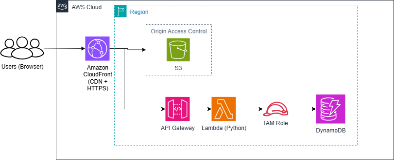

# ☁️ Cloud Resume Challenge (Terraform on AWS)

This repo deploys a **serverless resume website** using **Terraform** on AWS:
- **Frontend**: S3 (private) + CloudFront (HTTPS)
- **Visitor Counter API**: API Gateway → Lambda (Python) → DynamoDB
- **Security**: OAC (CloudFront ↔ S3), least-privilege IAM, logs
- **Cost**: Free-tier friendly

> Use the CloudFront-provided domain (e.g. `d1234abcd.cloudfront.net`) by default. You can add a custom domain + ACM later.



---

## 📦 Structure
```
cloud-resume-challenge/
├─ README.md
├─ .gitignore
├─ terraform/
│  ├─ providers.tf
│  ├─ variables.tf
│  ├─ main.tf
│  ├─ outputs.tf
│  └─ versions.tf
├─ lambda/
│  └─ counter.py
├─ resume/
│  └─ index.html
├─ diagrams/        
└─ screenshots/    
```

---

## 🚀 Quickstart

1) **Install**: Terraform ≥ 1.6, AWS CLI, Python 3.11+  
2) **Configure AWS creds** (env vars or `aws configure`).  
3) **Set variables**: Go into `terraform/terraform.tfvars` and edit values to match the values you want to use.  
4) **Deploy**:
```bash
cd terraform
terraform init
terraform plan
terraform apply -auto-approve
```
1) **Open your site**: Copy the `cloudfront_domain_name` output and visit it in your browser.  
2) **Destroy when done** (to avoid charges):
```bash
terraform destroy
```

---

## 🔐 Security Notes
- S3 bucket is **not public**; CloudFront uses **Origin Access Control (OAC)**.
- Lambda has the minimum IAM permissions to access DynamoDB.
- API Gateway only exposes a single `/count` `GET` method.

---

## 🧩 Next Steps (Optional Enhancements)
- Add a **custom domain** (Route 53) + ACM cert in **us-east-1**.
- Add **WAF** to CloudFront.
- CI/CD with **GitHub Actions** to run `terraform fmt/validate/plan`.

---

## 📝 Visitor Counter Integration (Frontend)
In your `resume/index.html`, call the API endpoint returned as `api_gateway_invoke_url`:
```html
<script>
  async function updateVisitorCount() {
    const r = await fetch("REPLACE_WITH_API_GATEWAY_URL/count");
    const text = await r.text();
    document.getElementById("visitorCount").innerText = text;
  }
  updateVisitorCount();
</script>
<div>Visitors: <span id="visitorCount">…</span></div>
```

---

## 🧹 Troubleshooting
- **AccessDenied to S3 through CloudFront**: Wait ~10–20 mins after `apply` for CloudFront to propagate.
- **API 403**: Ensure `Invoke` permissions are correct; re-apply if needed.
- **Lambda errors**: Check CloudWatch Logs for the function.

---

## ⚠️ Costs
This stack is designed to be within free tier. Still, **destroy** when not in use:
```bash
cd terraform && terraform destroy
```
